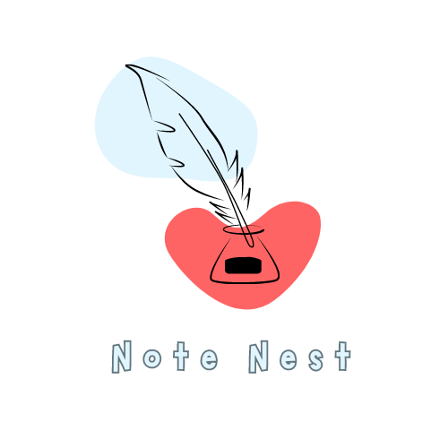

# Sankalp Mathur 
Welcome to my portfolio, where I showcase my projects and skills as a Flutter developer and mechanical engineering student.

## About Me

I'm a passionate Flutter developer with a strong interest in both software development and mechanical engineering. Currently pursuing a B.Tech in Mechanical Engineering, I'm excited to merge my engineering knowledge with my programming skills to create innovative solutions.

## Projects

### Project 1: Flutter Notes App

# Description

The Firestore Note App with BLoC is a powerful and intuitive note-taking application built using the Flutter framework. This app enables users to create, edit, and manage their notes seamlessly while harnessing the capabilities of Firebase Firestore for real-time data synchronization.

## Features

- **User Authentication:** Users can create accounts or log in using their credentials, ensuring a secure and personalized experience.

- **Note Creation and Editing:** Users can effortlessly create new notes, edit existing ones, and apply formatting to their text content.

- **Real-time Synchronization:** The app utilizes Firebase Firestore to synchronize notes across multiple devices in real time, providing users with instant access to their content.

- **BLoC State Management:** The BLoC (Business Logic Component) architecture is employed for effective state management. This ensures a separation of concerns, making the app more maintainable and testable.

- **Categorization and Organization:** Notes can be organized into categories or folders, allowing users to keep their thoughts and ideas well-structured.

- **Search and Filtering:** A robust search functionality enables users to quickly locate specific notes by keywords. Filtering options further enhance the user experience.

- **Responsive Design:** The app's user interface is responsive, adapting to various screen sizes and orientations, providing a consistent experience across devices.

## Technologies Used

- **Flutter:** The app is developed using the Flutter framework, enabling cross-platform compatibility and a native-like user experience.

- **Firebase Firestore:** Firestore is used to store and synchronize note data across devices in real time.

- **BLoC State Management:** The BLoC pattern manages the app's state and logic, promoting efficient code organization.

- **Firebase Authentication:** User authentication and security are ensured through Firebase Authentication services.

- **Firebase Storage:** Firebase Storage is used for efficiently managing and storing user-uploaded images or media within notes.

## Future Enhancements

- **Rich Media Support:** Integrate support for adding images, videos, and other multimedia elements to notes.

- **Collaboration:** Enable collaborative editing of notes among users, promoting teamwork and shared information.

- **Offline Mode:** Implement offline functionality to allow users to access their notes even when there's no internet connection.

- **Customizable Themes:** Allow users to personalize the app's appearance with customizable themes and color schemes.

## Conclusion

The Firestore Note App with BLoC offers users a seamless and feature-rich note-taking experience. By combining the power of Flutter, Firebase Firestore, and the BLoC pattern, the app stands as a testament to effective application architecture, real-time data synchronization, and user-centric design.

### Project 2: Kids Quiz App

# Firebase Quiz App with Realtime Rewards

The Firebase Quiz App with Realtime Rewards is an engaging educational application built using Flutter. This app offers users the opportunity to participate in quizzes, enhance their knowledge, and earn reward points in real time, all while utilizing Firebase for seamless user authentication and data management.

## Features

- **User Authentication:** Users can sign up and log in using their Firebase accounts, ensuring a secure and personalized experience.

- **Quiz Participation:** Engage users with a variety of quizzes on different topics. Quiz questions are fetched in real time from an external API, ensuring up-to-date content.

- **Realtime Rewards:** Firebase Realtime Database is utilized to store and update users' reward points in real time. Users can track their points as they participate in quizzes.

- **Leaderboard:** Implement a leaderboard to showcase users with the highest reward points. This encourages friendly competition and motivates users to engage more with the app.

- **Interactive User Interface:** The app features a user-friendly and interactive interface, making the quiz-taking experience enjoyable.

- **Progress Tracking:** Users can view their quiz history, scores, and earned rewards, providing a sense of achievement.

## Technologies Used

- **Flutter:** The app is developed using Flutter, allowing for a consistent user experience across different platforms.

- **Firebase Authentication:** Firebase Authentication is employed for user registration and authentication.

- **API Integration:** An external API is used to fetch quiz questions dynamically, ensuring that the content is always up-to-date.

- **Firebase Realtime Database:** Firebase Realtime Database is utilized to store users' reward points and maintain leaderboards.

- **State Management:** Flutter's state management solutions are employed for efficient data handling and UI updates.

## Future Enhancements

- **More Quiz Categories:** Expand the app's quiz offerings by adding a variety of categories and topics to cater to different interests.

- **Multiplayer Quizzes:** Implement real-time multiplayer quizzes, allowing users to compete with friends or other players globally.

- **User Profiles:** Create customizable user profiles where users can track their progress and customize their avatars.

- **Social Sharing:** Integrate social media sharing to enable users to share their quiz achievements and compete with friends.

## Conclusion

The Firebase Quiz App with Realtime Rewards provides an interactive and educational experience for users to enhance their knowledge while earning rewards. By combining the power of Flutter, Firebase Authentication, and Realtime Database, the app demonstrates effective user engagement, dynamic content, and real-time data synchronization.

## Technical Skills

- Flutter and Dart programming
- UI/UX design for mobile apps
- State management using Provider and Bloc
- RESTful API integration
- Version control with Git and GitHub

## Education

- B.Tech in Mechanical Engineering (Expected Graduation: YYYY)
- Relevant coursework: Fluid Mechanics, Thermodynamics, CAD Software

## Certifications

- Google's Flutter Certification (Month Year)

## Personal Projects

### Personal Project: Flutter Animation Gallery

- **Description:** An interactive gallery of various Flutter animations.
- **GitHub Repository:** [Animation Gallery Repo](https://github.com/yourusername/animation-gallery)

## Blog

### Blog Post: "Integrating Mechanical Principles into Flutter Development"

In this blog post, I explore how mechanical engineering concepts can be applied to mobile app development using Flutter.

Read the full post [here](blog/integrating-mechanical-principles.md).

## Contact Information

Feel free to reach out to me via email at your.email@example.com or connect with me on [LinkedIn](https://www.linkedin.com/in/yourusername/).

## Resume

For a more detailed overview of my skills and experiences, please refer to my [resume](resume.pdf).

---

Thank you for visiting my portfolio! I look forward to connecting with you and discussing potential collaborations.
